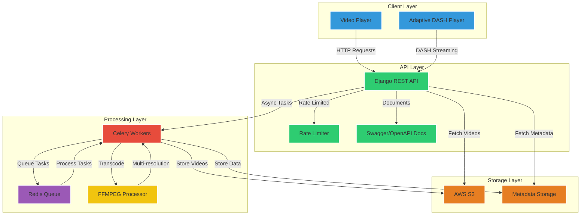

# StreamBuddy

StreamBuddy is a scalable video streaming platform built using Django REST API, DASH, and AWS S3 for storage. It features an asynchronous video processing pipeline, adaptive bitrate streaming, and comprehensive API documentation.

## Features

- **Scalable Video Streaming**: Architected using Django REST API, DASH, and AWS S3 for efficient storage and streaming.
- **Asynchronous Video Processing**: Utilizes Celery and Redis to handle concurrent video uploads efficiently.
- **Adaptive Bitrate Streaming**: Achieves 60-80% size reduction while maintaining 85-90% quality through multi-resolution encoding using FFMPEG.
- **Comprehensive API Documentation**: Designed with Swagger/OpenAPI, including rate limiting and monitoring.

## Architecture Diagram

## Project Structure