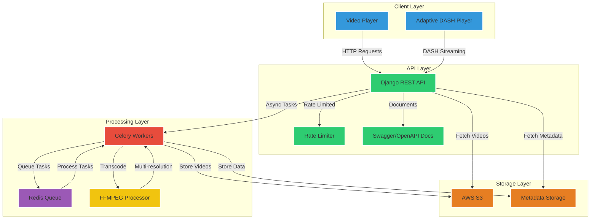

# StreamBuddy: Video Streaming Platform with DASH Support

StreamBuddy is a scalable video streaming platform built using Django REST API, DASH, and AWS S3 for storage. It features an asynchronous video processing pipeline, adaptive bitrate streaming, and comprehensive API documentation.


## 🚀 Features

- **Secure Video Upload**
  - Support for large file uploads (up to 10GB)
  - Mime type validation
  - Progress tracking
  - Resumable uploads

- **Video Processing**
  - Asynchronous processing using Celery
  - Multi-resolution encoding (480p to 4K)
  - DASH manifest generation
  - 60-80% size reduction while maintaining 85-90% quality

- **Streaming Capabilities**
  - DASH (Dynamic Adaptive Streaming over HTTP) support
  - Adaptive bitrate streaming
  - Real-time quality switching
  - Low latency streaming

- **Security & Performance**
  - Rate limiting for API endpoints
  - AWS S3 integration for scalable storage
  - Comprehensive API documentation
  - CORS support


## 🏗️ Architecture Diagram


## 🛠️ Technical Stack

- **Backend**: Django REST Framework
- **Video Processing**: FFMPEG
- **Task Queue**: Celery with Redis
- **Storage**: AWS S3 / Local Storage
- **Documentation**: Swagger/OpenAPI
- **Container**: Docker & Docker Compose

## 📋 Prerequisites

- Python 3.10 or higher
- FFmpeg
- Redis
- Docker & Docker Compose (optional)
- AWS Account (optional, for S3 storage)

## 🔧 Installation

### Using Docker (Recommended)

1. Clone the repository:
```bash
git clone https://github.com/yourusername/streambuddy.git
cd streambuddy
```

2. Create and configure `.env` file:
```bash
cp app/.env.template app/.env
# Edit .env with your settings
```

3. Build and run using Docker Compose:
```bash
docker-compose up --build
```
### Manual Installation

1. Install system dependencies:
```bash
# Ubuntu/Debian
sudo apt-get update
sudo apt-get install ffmpeg python3-dev

# macOS
brew install ffmpeg
```

2. Install Python dependencies:
```bash
python -m venv venv
source venv/bin/activate  # On Windows: venv\Scripts\activate
pip install -e .
```

3. Set up Redis:
```bash
# Ubuntu/Debian
sudo apt-get install redis-server
sudo systemctl start redis

# macOS
brew install redis
brew services start redis
```

4. Run migrations:
```bash
python manage.py migrate
```

5. Start the development server:
```bash
python manage.py runserver
```

6. Start Celery worker:
```bash
celery -A streambuddy worker --loglevel=info
```
## ⚙️ Configuration

Key configuration options in `.env`:

```env
DEBUG=True
DJANGO_SECRET_KEY=your-secret-key
ALLOWED_HOSTS=localhost,127.0.0.1
MAX_UPLOAD_SIZE=10737418240
DEFAULT_VIDEO_QUALITY=1080p

# AWS Configuration (optional)
AWS_ACCESS_KEY_ID=your-access-key
AWS_SECRET_ACCESS_KEY=your-secret-key
AWS_STORAGE_BUCKET_NAME=your-bucket
AWS_S3_REGION_NAME=your-region
```

## 🔐 Security Settings

The platform includes several security measures:

- Rate limiting:
  - Anonymous users: 100 requests/day
  - Authenticated users: 1000 requests/day
  - Video uploads: 10/day
  - Streaming: 1000 requests/hour

- CORS configuration in settings.py
- AWS S3 secure configuration
- Input validation and sanitization

## 📚 API Documentation

API documentation is available at `/swagger/` or `/redoc/` after starting the server.

Key endpoints:
- `POST /api/videos/upload/`: Upload new video
- `GET /api/videos/`: List all videos
- `GET /api/videos/{title}/`: Stream video

## 📦 Production Deployment

For production deployment:

1. Update `.env` with production settings:
```env
DEBUG=False
ALLOWED_HOSTS=your-domain.com
USE_S3=True

## 🤝 Contributing

1. Fork the repository
2. Create your feature branch
3. Commit your changes
4. Push to the branch
5. Create a Pull Request

## 📄 License

This project is licensed under the MIT License - see the LICENSE file for details.

## 🙏 Acknowledgments

- FFmpeg team for the excellent video processing library
- Django and Django REST Framework communities
- AWS for providing scalable storage solutions
